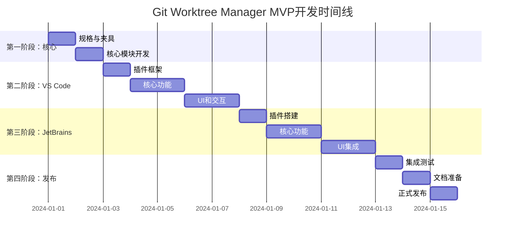

# Git Worktree Manager - 完整可行性方案
> 一个跨IDE的Git Worktree管理工具，优化AI辅助编程工作流

## 项目概述

### 背景与动机
- **问题场景**：使用AI工具进行编码时，经常需要同时修改同一项目的不同功能
- **解决方案**：利用Git Worktree特性，在不同分支独立开发，最后合并
- **痛点**：纯命令行操作不便，缺乏可视化管理工具
- **目标用户**：使用AI辅助编程的开发者、需要并行开发多个特性的团队

### 核心价值
1. **提升效率**：可视化管理，减少命令行操作
2. **降低门槛**：让更多开发者能够使用Git Worktree
3. **优化工作流**：专为AI编程场景优化
4. **统一体验**：跨IDE平台的一致体验

## 技术方案

### 架构设计

```
┌─────────────────────────────────────────────────────┐
│                    用户界面层                        │
├──────────────────┬──────────────────────────────────┤
│   VS Code插件    │        JetBrains插件              │
│  (TypeScript)    │        (Kotlin/Java)             │
├──────────────────┴──────────────────────────────────┤
│                  核心逻辑层                          │
│              (TypeScript/Node.js)                    │
│   ┌──────────────────────────────────────┐         │
│   │  Git操作 | Worktree管理 | 状态监控   │         │
│   └──────────────────────────────────────┘         │
├──────────────────────────────────────────────────────┤
│                   系统层                             │
│         Git命令行工具 | 文件系统 | Shell             │
└──────────────────────────────────────────────────────┘
```

### 项目结构（Monorepo）

```
git-worktree-manager/
├── spec/                    # 统一规格与测试夹具
│   ├── fixtures/           # Git命令输出样本
│   │   ├── worktree-list/
│   │   │   ├── basic.txt
│   │   │   ├── locked.txt
│   │   │   ├── detached-head.txt
│   │   │   └── windows-paths.txt
│   │   └── status/
│   │       ├── clean.txt
│   │       └── dirty.txt
│   └── expected/           # 期望的解析结果
│       ├── worktree-list/*.json
│       └── status/*.json
├── packages/
│   ├── core/               # 共享核心逻辑
│   │   ├── src/
│   │   ├── tests/
│   │   └── package.json
│   ├── vscode-extension/   # VS Code插件
│   │   ├── src/
│   │   ├── resources/
│   │   └── package.json
│   └── jetbrains-plugin/   # JetBrains插件
│       ├── src/main/
│       └── build.gradle.kts
├── shared/                  # 共享资源
│   ├── icons/
│   └── config/
├── scripts/                 # 构建和发布脚本
├── docs/                    # 文档
└── .github/workflows/       # CI/CD配置
    ├── ci-core.yml
    ├── ci-vscode.yml
    ├── ci-jetbrains.yml
    └── release.yml
```

### 技术栈选择

#### 核心模块
- **语言**：TypeScript 5.x（可从零依赖JS起步）
- **运行时**：Node.js 18+ LTS
- **Git操作**：直接调用Git CLI，使用 `--porcelain` 机器可读格式
- **测试**：Jest + 测试夹具（fixtures）
- **构建**：ESBuild

#### VS Code插件
- **框架**：VS Code Extension API
- **UI**：Webview (React 18)
- **状态管理**：Zustand
- **样式**：Tailwind CSS
- **打包**：Webpack 5

#### JetBrains插件
- **语言**：Kotlin 1.9
- **框架**：IntelliJ Platform SDK
- **UI**：Swing + IntelliJ UI DSL
- **构建**：Gradle 8.x
- **最低版本**：2023.1

## 功能规划

### MVP版本 (v1.0)
#### 基础功能
- [x] 列出所有worktree
- [x] 创建新worktree（基于分支/标签）
- [x] 删除worktree
- [x] 切换活动worktree
- [x] 显示worktree状态

#### UI集成
- [x] 侧边栏/工具窗口
- [x] 状态栏显示
- [x] 命令面板/动作
- [x] 右键菜单

#### 便捷操作
- [x] 快速切换（快捷键）
- [x] 在终端中打开
- [x] 在文件管理器中打开

### 增强版本 (v1.1)
- [ ] Worktree间文件对比
- [ ] 批量操作（删除、更新）
- [ ] 搜索和过滤
- [ ] 自定义worktree路径模板

### 高级版本 (v2.0)
- [ ] 可视化Merge界面
- [ ] 冲突解决工具
- [ ] Worktree依赖图
- [ ] AI任务分配建议
- [ ] 团队协作功能

## 统一规格设计

### Git命令映射

```bash
# 列出worktree（使用--porcelain格式）
git worktree list --porcelain

# 创建worktree
git worktree add <path> <branch>              # 基于已有分支
git worktree add -b <new-branch> <path>       # 创建新分支

# 删除worktree
git worktree remove <path>
git worktree remove --force <path>            # 强制删除

# 锁定/解锁
git worktree lock <path>
git worktree unlock <path>

# 状态检查
git -C <path> status --porcelain -b           # 获取worktree状态

# 合并操作
git -C <target-path> merge <source-branch>    # 在目标worktree执行合并
```

### 数据模型

```typescript
interface Worktree {
  path: string;           // 绝对路径
  branch?: string;        // 分支名（可能为空）
  head: string;          // HEAD commit SHA
  locked: boolean;       // 是否锁定
  prunable?: boolean;    // 是否可清理
  reason?: string;       // 锁定原因
}

interface WorktreeStatus {
  dirty: boolean;        // 是否有未提交更改
  ahead: number;        // 领先远程分支的提交数
  behind: number;       // 落后远程分支的提交数
  staged: number;       // 暂存文件数
  modified: number;     // 修改文件数
  untracked: number;    // 未跟踪文件数
}
```

### 解析规范

- 使用 `--porcelain` 输出确保跨平台一致性
- Windows路径处理：参数严格转义，处理空格和特殊字符
- 换行符统一处理：`\r\n` 和 `\n`
- 错误处理：提供原始命令复制功能

## 详细实现计划（优化版）

### 第一阶段：核心模块与规格（3天）

#### Day 1: 统一规格与测试夹具

**任务清单**：
- [ ] 创建spec/fixtures目录结构
- [ ] 收集Git worktree各种输出样本
- [ ] 编写expected JSON格式
- [ ] 创建测试数据生成脚本
- [ ] 文档化解析规范

```bash
# 创建测试夹具结构
mkdir -p spec/fixtures/worktree-list
mkdir -p spec/fixtures/status
mkdir -p spec/expected

# 收集样本输出
git worktree list --porcelain > spec/fixtures/worktree-list/basic.txt
```
```bash
# 初始化monorepo结构
mkdir git-worktree-manager
cd git-worktree-manager
npm init -y

# 使用pnpm workspace（更高效）
cat > pnpm-workspace.yaml <<EOF
packages:
  - 'packages/*'
  - 'plugins/*'
EOF

# 创建子包
mkdir -p packages/{core,shared}
mkdir -p plugins/{vscode,jetbrains}
mkdir -p spec/{fixtures,expected}
mkdir -p scripts
```

#### Day 2: 核心模块开发

**任务清单**：
- [ ] 实现Git命令封装
- [ ] 实现--porcelain解析器
- [ ] 创建统一数据模型
- [ ] 编写单元测试
- [ ] 创建CLI接口

```typescript
// packages/core/src/git-worktree.ts
export class GitWorktreeManager {
  async listWorktrees(): Promise<Worktree[]> {
    const output = await this.execGit(['worktree', 'list', '--porcelain']);
    return this.parseWorktreeList(output);
  }
  
  private async execGit(args: string[]): Promise<string> {
    // 使用child_process.execFile确保安全
    return new Promise((resolve, reject) => {
      execFile('git', args, { encoding: 'utf8' }, (error, stdout) => {
        if (error) reject(error);
        else resolve(stdout);
      });
    });
  }
}
```

#### Day 3-4: 核心功能实现
```typescript
// packages/core/src/worktree-manager.ts
export interface IWorktreeManager {
  listWorktrees(): Promise<Worktree[]>;
  createWorktree(options: CreateOptions): Promise<void>;
  deleteWorktree(path: string): Promise<void>;
  switchWorktree(path: string): Promise<void>;
  getWorktreeStatus(path: string): Promise<WorktreeStatus>;
}
```

**任务清单**：
- [ ] 实现worktree列表功能
- [ ] 实现创建/删除worktree
- [ ] 实现状态检测
- [ ] 添加错误处理
- [ ] 编写单元测试

#### Day 5: CLI工具和测试
```json
// packages/core/package.json
{
  "bin": {
    "gwt": "./dist/cli.js"
  },
  "scripts": {
    "test": "jest",
    "test:coverage": "jest --coverage",
    "build": "tsc",
    "watch": "tsc -w"
  }
}
```

**任务清单**：
- [ ] 开发CLI接口
- [ ] 完善测试覆盖
- [ ] 性能优化
- [ ] 文档编写

### 第二阶段：VS Code插件开发（5天）

#### Day 3: VS Code插件框架

**快速初始化**：
```bash
# 零依赖快速启动
cd plugins/vscode
cat > package.json <<'EOF'
{
  "name": "git-worktrees",
  "displayName": "Git Worktrees",
  "version": "0.0.1",
  "engines": { "vscode": "^1.85.0" },
  "main": "./out/extension.js",
  "activationEvents": ["onStartupFinished"],
  "contributes": {
    "viewsContainers": {
      "activitybar": [{
        "id": "worktrees",
        "title": "Git Worktrees",
        "icon": "media/icon.svg"
      }]
    },
    "views": {
      "worktrees": [{
        "id": "worktreesView",
        "name": "Worktrees",
        "contextualTitle": "Git Worktrees"
      }]
    },
    "commands": [
      {
        "command": "gitWorktree.refresh",
        "title": "Refresh",
        "icon": "$(refresh)"
      },
      {
        "command": "gitWorktree.add",
        "title": "Add Worktree",
        "icon": "$(add)"
      },
      {
        "command": "gitWorktree.switch",
        "title": "Switch Worktree"
      }
    ],
    "keybindings": [
      {
        "command": "gitWorktree.switch",
        "key": "ctrl+alt+w",
        "mac": "cmd+alt+w"
      }
    ],
    "configuration": {
      "title": "Git Worktrees",
      "properties": {
        "gitWorktrees.showInStatusBar": {
          "type": "boolean",
          "default": true,
          "description": "Show current worktree in status bar"
        }
      }
    }
  }
}
EOF

# 创建入口文件
cat > extension.js <<'EOF'
const vscode = require('vscode');
const { execFile } = require('child_process');

function activate(context) {
    console.log('Git Worktrees is now active!');
    
    // 注册刷新命令
    const refreshCmd = vscode.commands.registerCommand('gitWorktree.refresh', () => {
        vscode.window.showInformationMessage('Refreshing worktrees...');
    });
    
    context.subscriptions.push(refreshCmd);
}

module.exports = { activate };
EOF
```

```typescript
// 后续迁移到TypeScript
// packages/vscode-extension/src/extension.ts
import * as vscode from 'vscode';
import { WorktreeProvider } from './providers/worktree-provider';
import { WorktreeStatusBar } from './statusbar';

export function activate(context: vscode.ExtensionContext) {
  // 注册树视图
  const provider = new WorktreeProvider();
  vscode.window.registerTreeDataProvider('worktreesView', provider);
  
  // 注册命令
  registerCommands(context);
  
  // 状态栏
  const statusBar = new WorktreeStatusBar();
  context.subscriptions.push(statusBar);
  
  // 终端集成
  context.subscriptions.push(
    vscode.commands.registerCommand('gitWorktree.openTerminal', (worktree) => {
      const terminal = vscode.window.createTerminal({
        name: `Worktree: ${worktree.branch}`,
        cwd: worktree.path
      });
      terminal.show();
    })
  );
}
```

**任务清单**：
- [ ] 使用Yeoman生成插件模板
- [ ] 实现TreeDataProvider
- [ ] 注册基础命令
- [ ] 添加图标资源

#### Day 8-9: UI组件开发
```typescript
// Webview面板
class WorktreeWebviewPanel {
  public static createOrShow(context: vscode.ExtensionContext) {
    const panel = vscode.window.createWebviewPanel(
      'worktreeManager',
      'Worktree Manager',
      vscode.ViewColumn.One,
      {
        enableScripts: true,
        retainContextWhenHidden: true
      }
    );
    
    panel.webview.html = this.getWebviewContent();
  }
}
```

**任务清单**：
- [ ] 开发Webview界面
- [ ] 实现快速选择器
- [ ] 添加状态栏项
- [ ] 配置菜单和快捷键

#### Day 10-11: 高级功能
**任务清单**：
- [ ] 集成终端功能
- [ ] 添加文件对比
- [ ] 实现设置页面
- [ ] 国际化支持

#### Day 12: 测试和打包
```json
// .vscodeignore
.vscode/**
src/**
**/*.ts
**/*.map
node_modules/**
```

**任务清单**：
- [ ] 编写集成测试
- [ ] 优化打包大小
- [ ] 准备发布资料
- [ ] 本地测试验证

### 第三阶段：JetBrains插件开发（5天）

#### Day 8: JetBrains插件快速搭建

**快速初始化**：
```bash
# 快速搭建JetBrains插件
cd plugins/jetbrains

# 创建Gradle配置
cat > settings.gradle.kts <<'KTS'
rootProject.name = "git-worktrees"
KTS

cat > build.gradle.kts <<'KTS'
plugins {
    kotlin("jvm") version "1.9.24"
    id("org.jetbrains.intellij") version "1.17.2"
}

group = "com.gitworktree"
version = "1.0.0"

repositories {
    mavenCentral()
}

intellij {
    version.set("2024.1")
    type.set("IC")
    plugins.set(listOf("git4idea", "terminal"))
}

tasks {
    buildSearchableOptions {
        enabled = false
    }
    
    patchPluginXml {
        sinceBuild.set("231")
        untilBuild.set("241.*")
    }
    
    signPlugin {
        certificateChain.set(System.getenv("CERTIFICATE_CHAIN"))
        privateKey.set(System.getenv("PRIVATE_KEY"))
        password.set(System.getenv("PRIVATE_KEY_PASSWORD"))
    }
    
    publishPlugin {
        token.set(System.getenv("INTELLIJ_PUBLISH_TOKEN"))
    }
}
KTS

# 创建plugin.xml
mkdir -p src/main/resources/META-INF
cat > src/main/resources/META-INF/plugin.xml <<'XML'
<idea-plugin>
    <id>com.gitworktree.manager</id>
    <name>Git Worktree Manager</name>
    <version>1.0.0</version>
    <vendor>Your Name</vendor>
    
    <depends>com.intellij.modules.platform</depends>
    <depends>Git4Idea</depends>
    <depends>org.jetbrains.plugins.terminal</depends>
    
    <extensions defaultExtensionNs="com.intellij">
        <toolWindow id="Git Worktrees"
                    anchor="left"
                    factoryClass="com.gitworktree.ui.WorktreeToolWindowFactory"
                    icon="/icons/worktree.svg"/>
        
        <statusBarWidgetFactory id="WorktreeStatusWidget"
                                implementation="com.gitworktree.ui.WorktreeStatusBarFactory"/>
        
        <projectService serviceImplementation="com.gitworktree.service.WorktreeService"/>
    </extensions>
    
    <actions>
        <action id="GitWorktree.Add"
                class="com.gitworktree.actions.AddWorktreeAction"
                text="Add Worktree...">
            <add-to-group group-id="Git.Menu"/>
            <keyboard-shortcut first-keystroke="ctrl shift alt W"/>
        </action>
        
        <action id="GitWorktree.Switch"
                class="com.gitworktree.actions.SwitchWorktreeAction"
                text="Switch Worktree...">
            <keyboard-shortcut first-keystroke="ctrl alt W"/>
        </action>
    </actions>
</idea-plugin>
XML
```

```kotlin
// src/main/kotlin/com/gitworktree/service/WorktreeService.kt
package com.gitworktree.service

import com.intellij.execution.configurations.GeneralCommandLine
import com.intellij.execution.process.ScriptRunnerUtil
import com.intellij.openapi.components.Service
import com.intellij.openapi.project.Project

@Service(Service.Level.PROJECT)
class WorktreeService(private val project: Project) {
    
    fun listWorktrees(): List<Worktree> {
        val cmd = GeneralCommandLine("git", "worktree", "list", "--porcelain")
            .withWorkDirectory(project.basePath)
        
        val output = ScriptRunnerUtil.getProcessOutput(cmd)
        return parseWorktreeList(output)
    }
    
    fun createWorktree(branch: String, path: String) {
        val cmd = GeneralCommandLine("git", "worktree", "add", path, branch)
            .withWorkDirectory(project.basePath)
        
        ScriptRunnerUtil.getProcessOutput(cmd)
    }
    
    private fun parseWorktreeList(output: String): List<Worktree> {
        // 解析--porcelain输出
        return output.split("\n\n")
            .filter { it.isNotBlank() }
            .map { parseWorktree(it) }
    }
}

data class Worktree(
    val path: String,
    val branch: String?,
    val head: String,
    val locked: Boolean
)
```

**任务清单**：
- [ ] 配置开发环境
- [ ] 创建插件项目
- [ ] 实现基础服务
- [ ] 配置plugin.xml

#### Day 15-16: 工具窗口开发
```kotlin
class WorktreeToolWindow(private val project: Project) {
    fun createContent(): JComponent {
        return panel {
            row {
                scrollPane(worktreeTree)
            }
            row {
                button("Create") { createWorktree() }
                button("Delete") { deleteWorktree() }
                button("Refresh") { refresh() }
            }
        }
    }
}
```

**任务清单**：
- [ ] 实现工具窗口
- [ ] 开发树形组件
- [ ] 添加工具栏
- [ ] 实现右键菜单

#### Day 17-18: 动作和集成
```kotlin
class SwitchWorktreeAction : AnAction() {
    override fun actionPerformed(e: AnActionEvent) {
        val project = e.project ?: return
        val worktrees = WorktreeService.getInstance(project).listWorktrees()
        
        val popup = JBPopupFactory.getInstance()
            .createListPopup(WorktreeListStep(worktrees))
        popup.showCenteredInCurrentWindow(project)
    }
}
```

**任务清单**：
- [ ] 实现各种Action
- [ ] 集成到IDE菜单
- [ ] 添加快捷键
- [ ] 状态栏组件

#### Day 19-20: Node.js桥接和测试
```kotlin
// 调用核心模块
class WorktreeCoreService {
    fun executeCommand(command: String): String {
        val process = ProcessBuilder("node", corePath, command)
            .directory(projectPath)
            .start()
        
        return process.inputStream.bufferedReader().readText()
    }
}
```

**任务清单**：
- [ ] 实现Node.js调用
- [ ] 错误处理
- [ ] 性能测试
- [ ] 打包配置

### 第四阶段：集成测试和发布（3天）

#### Day 13: 集成测试和优化
**测试矩阵**：
| 平台 | IDE版本 | Node版本 | Git版本 |
|------|---------|----------|---------|
| macOS | VS Code 1.85+ | 18.x, 20.x | 2.40+ |
| Windows | VS Code 1.85+ | 18.x, 20.x | 2.40+ |
| Linux | VS Code 1.85+ | 18.x, 20.x | 2.40+ |
| All | IntelliJ 2023.1+ | 18.x, 20.x | 2.40+ |

**任务清单**：
- [ ] 功能测试
- [ ] 性能测试
- [ ] 兼容性测试
- [ ] 用户体验测试

#### Day 14: 文档和发布准备
**文档清单**：
- [ ] README.md - 项目介绍
- [ ] INSTALLATION.md - 安装指南
- [ ] USAGE.md - 使用手册
- [ ] CONTRIBUTING.md - 贡献指南
- [ ] API.md - API文档
- [ ] CHANGELOG.md - 更新日志

#### Day 15: 正式发布
**发布检查清单**：
- [ ] 版本号更新
- [ ] 更新日志编写
- [ ] 图标和截图准备
- [ ] 市场描述编写
- [ ] 演示视频录制
- [ ] 发布公告准备

## 开发流程

### 分支策略
```
main
├─ develop
│  ├─ feature/core-module
│  ├─ feature/vscode-extension
│  └─ feature/jetbrains-plugin
└─ release/v1.0.0
```

### CI/CD配置（增强版）

#### 核心模块CI
```yaml
# .github/workflows/ci-core.yml
name: Core Module CI

on:
  push:
    paths:
      - 'packages/core/**'
      - 'spec/**'
  pull_request:
    paths:
      - 'packages/core/**'
      - 'spec/**'

jobs:
  test:
    runs-on: ${{ matrix.os }}
    strategy:
      matrix:
        os: [ubuntu-latest, windows-latest, macos-latest]
        node: ['18', '20']
    steps:
      - uses: actions/checkout@v4
      - uses: actions/setup-node@v4
        with:
          node-version: ${{ matrix.node }}
      - uses: pnpm/action-setup@v2
        with:
          version: 8
      - run: pnpm install --frozen-lockfile
      - run: pnpm test:core
      - run: pnpm build:core
      - uses: actions/upload-artifact@v3
        with:
          name: core-build-${{ matrix.os }}-${{ matrix.node }}
          path: packages/core/dist
```

#### VS Code插件CI
```yaml
# .github/workflows/ci-vscode.yml
name: VS Code Extension CI

on:
  push:
    paths:
      - 'plugins/vscode/**'
      - 'packages/core/**'
  pull_request:
    paths:
      - 'plugins/vscode/**'

jobs:
  test:
    runs-on: ${{ matrix.os }}
    strategy:
      matrix:
        os: [ubuntu-latest, windows-latest, macos-latest]
        vscode: ['stable', 'insiders']
    steps:
      - uses: actions/checkout@v4
      - uses: actions/setup-node@v4
        with:
          node-version: '18'
      - run: npm ci
        working-directory: plugins/vscode
      - run: npm run compile
        working-directory: plugins/vscode
      - run: xvfb-run -a npm test
        if: runner.os == 'Linux'
        working-directory: plugins/vscode
        env:
          VSCODE_VERSION: ${{ matrix.vscode }}
      - run: npm test
        if: runner.os != 'Linux'
        working-directory: plugins/vscode
        env:
          VSCODE_VERSION: ${{ matrix.vscode }}
      - run: npx vsce package
        working-directory: plugins/vscode
      - uses: actions/upload-artifact@v3
        with:
          name: vscode-vsix-${{ matrix.os }}
          path: plugins/vscode/*.vsix
```

#### JetBrains插件CI
```yaml
# .github/workflows/ci-jetbrains.yml
name: JetBrains Plugin CI

on:
  push:
    paths:
      - 'plugins/jetbrains/**'
  pull_request:
    paths:
      - 'plugins/jetbrains/**'

jobs:
  test:
    runs-on: ubuntu-latest
    steps:
      - uses: actions/checkout@v4
      - uses: actions/setup-java@v4
        with:
          distribution: 'temurin'
          java-version: '17'
      - uses: gradle/gradle-build-action@v2
      - run: ./gradlew test
        working-directory: plugins/jetbrains
      - run: ./gradlew buildPlugin
        working-directory: plugins/jetbrains
      - run: ./gradlew verifyPlugin
        working-directory: plugins/jetbrains
      - uses: actions/upload-artifact@v3
        with:
          name: jetbrains-plugin
          path: plugins/jetbrains/build/distributions/*.zip
```

#### 自动发布工作流
```yaml
# .github/workflows/release.yml
name: Release

on:
  push:
    tags:
      - 'v*.*.*'

jobs:
  release-vscode:
    runs-on: ubuntu-latest
    steps:
      - uses: actions/checkout@v4
      - uses: actions/setup-node@v4
        with:
          node-version: '18'
      - run: npm ci
        working-directory: plugins/vscode
      - run: npm run compile
        working-directory: plugins/vscode
      - name: Publish to VS Code Marketplace
        run: npx vsce publish -p ${{ secrets.VSCE_PAT }}
        working-directory: plugins/vscode
      - name: Publish to Open VSX
        run: npx ovsx publish -p ${{ secrets.OVSX_PAT }}
        working-directory: plugins/vscode

  release-jetbrains:
    runs-on: ubuntu-latest
    steps:
      - uses: actions/checkout@v4
      - uses: actions/setup-java@v4
        with:
          distribution: 'temurin'
          java-version: '17'
      - name: Sign and Publish Plugin
        env:
          CERTIFICATE_CHAIN: ${{ secrets.CERTIFICATE_CHAIN }}
          PRIVATE_KEY: ${{ secrets.PRIVATE_KEY }}
          PRIVATE_KEY_PASSWORD: ${{ secrets.PRIVATE_KEY_PASSWORD }}
          INTELLIJ_PUBLISH_TOKEN: ${{ secrets.INTELLIJ_PUBLISH_TOKEN }}
        run: |
          ./gradlew signPlugin
          ./gradlew publishPlugin
        working-directory: plugins/jetbrains

  create-release:
    needs: [release-vscode, release-jetbrains]
    runs-on: ubuntu-latest
    steps:
      - uses: actions/checkout@v4
      - uses: actions/download-artifact@v3
      - name: Create GitHub Release
        uses: softprops/action-gh-release@v1
        with:
          files: |
            vscode-vsix-*/*.vsix
            jetbrains-plugin/*.zip
          generate_release_notes: true
          draft: false
          prerelease: ${{ contains(github.ref, 'beta') || contains(github.ref, 'alpha') }}
```

### 代码质量保证

#### 代码规范
```json
// .eslintrc.json
{
  "extends": [
    "eslint:recommended",
    "plugin:@typescript-eslint/recommended",
    "prettier"
  ],
  "rules": {
    "no-console": "warn",
    "@typescript-eslint/explicit-module-boundary-types": "error"
  }
}
```

#### 预提交钩子
```json
// package.json
{
  "husky": {
    "hooks": {
      "pre-commit": "lint-staged",
      "commit-msg": "commitlint -E HUSKY_GIT_PARAMS"
    }
  },
  "lint-staged": {
    "*.{ts,tsx}": ["eslint --fix", "prettier --write"],
    "*.{json,md}": ["prettier --write"]
  }
}
```

#### 提交规范
```
feat: 新功能
fix: 修复bug
docs: 文档更新
style: 代码格式
refactor: 重构
test: 测试
chore: 构建/工具
```

## 发布流程

### VS Code插件发布

#### 1. 准备发布
```bash
# 安装vsce
npm install -g vsce

# 打包插件
vsce package

# 生成.vsix文件
```

#### 2. 发布到Marketplace
```bash
# 登录发布
vsce login <publisher>

# 发布插件
vsce publish

# 或指定版本
vsce publish minor
```

#### 3. 发布要求
- [ ] Publisher账号
- [ ] 个人访问令牌(PAT)
- [ ] 插件图标(128x128)
- [ ] README带截图
- [ ] package.json完整信息

### JetBrains插件发布

#### 1. 构建插件
```bash
# 构建插件
./gradlew buildPlugin

# 生成的文件位置
# build/distributions/git-worktree-manager-1.0.0.zip
```

#### 2. 发布到Marketplace
1. 登录 https://plugins.jetbrains.com
2. 点击"Upload plugin"
3. 上传zip文件
4. 填写更新说明
5. 提交审核

#### 3. 发布要求
- [ ] JetBrains账号
- [ ] 插件描述(HTML)
- [ ] 更新日志
- [ ] 截图(至少1张)
- [ ] 兼容性信息

### 版本管理

#### 版本号规则
```
主版本.次版本.修订版本
1.0.0 - 初始发布
1.1.0 - 新功能
1.1.1 - Bug修复
```

#### 发布周期
- **修复版本**：随时发布
- **功能版本**：每月一次
- **主要版本**：每季度评估

### 自动化发布
```yaml
# .github/workflows/release.yml
name: Release

on:
  push:
    tags:
      - 'v*'

jobs:
  release-vscode:
    runs-on: ubuntu-latest
    steps:
      - uses: actions/checkout@v3
      - uses: actions/setup-node@v3
      - run: npm ci
      - run: npm run build:vscode
      - run: |
          cd packages/vscode-extension
          npx vsce publish -p ${{ secrets.VSCE_TOKEN }}

  release-jetbrains:
    runs-on: ubuntu-latest
    steps:
      - uses: actions/checkout@v3
      - uses: actions/setup-java@v3
      - run: |
          cd packages/jetbrains-plugin
          ./gradlew publishPlugin \
            -Ppublish.token=${{ secrets.JETBRAINS_TOKEN }}
```

## 项目管理

### 里程碑计划

#### Phase 1: MVP (4周)
- Week 1: 核心模块开发
- Week 2: VS Code插件基础
- Week 3: JetBrains插件基础
- Week 4: 测试和发布

#### Phase 2: 增强版 (2周)
- Week 5: 高级功能开发
- Week 6: 优化和发布

#### Phase 3: 企业版 (4周)
- Week 7-8: 团队协作功能
- Week 9: AI集成
- Week 10: 测试和发布

### 资源需求

#### 人力资源
- **核心开发**：1-2名全栈开发者
- **UI设计**：兼职设计师(可选)
- **测试**：社区测试者
- **文档**：技术写作者(可选)

#### 硬件资源
- 开发机器(macOS/Windows/Linux)
- 测试设备(多平台)

#### 服务资源
- GitHub仓库
- npm账号
- VS Code Publisher账号
- JetBrains Developer账号
- 域名(可选)

### 成本预算

#### 开发成本
- 开发时间：约25个工作日
- 人力成本：根据团队情况

#### 运营成本
- VS Code发布：免费
- JetBrains发布：免费
- GitHub：免费(开源)
- npm私有包：$7/月(可选)
- 域名：$15/年(可选)

### 风险评估

#### 技术风险与缓解（详细版）

| 风险 | 概率 | 影响 | 缓解措施 |
|------|------|------|----------|
| **Git版本兼容性** | 中 | 高 | 1. 检测git版本，提示最低要求<br>2. 降级处理旧版本<br>3. 测试矩阵覆盖2.30-2.40+ |
| **Windows路径问题** | 高 | 高 | 1. 使用`execFile`代替`exec`<br>2. 参数严格转义<br>3. 特殊字符处理<br>4. 夹具覆盖空格路径 |
| **大仓库性能** | 中 | 高 | 1. 懒加载文件树<br>2. 手动刷新+节流<br>3. 后台任务可取消<br>4. 缓存已解析结果 |
| **IDE API变更** | 低 | 中 | 1. 版本范围锁定<br>2. CI测试多版本<br>3. 平滑迁移计划 |
| **合并冲突体验** | 中 | 中 | 1. 不自研冲突器<br>2. 调用IDE原生能力<br>3. 提供命令复制 |
| **权限/沙箱问题** | 低 | 高 | 1. 操作前检测可写性<br>2. 错误提供"复制命令"<br>3. "在终端重试"选项 |

#### 具体缓解实现

```typescript
// Windows路径处理
export function execGitSafe(args: string[], cwd?: string): Promise<string> {
  return new Promise((resolve, reject) => {
    // 使用execFile避免shell注入
    execFile(
      'git',
      args,
      {
        cwd: cwd || process.cwd(),
        encoding: 'utf8',
        maxBuffer: 10 * 1024 * 1024, // 10MB
        windowsHide: true,
        // Windows特殊处理
        shell: process.platform === 'win32' ? false : undefined
      },
      (error, stdout, stderr) => {
        if (error) {
          // 提供可复制的命令
          const cmd = `git ${args.join(' ')}`;
          reject(new Error(
            `Git command failed: ${error.message}\n` +
            `Command: ${cmd}\n` +
            `You can copy this command and run it in terminal.`
          ));
        } else {
          resolve(stdout);
        }
      }
    );
  });
}

// 大仓库性能优化
class WorktreeCache {
  private cache = new Map<string, { data: Worktree[], timestamp: number }>();
  private readonly TTL = 5000; // 5秒缓存
  
  async getWorktrees(repoPath: string, force = false): Promise<Worktree[]> {
    const cached = this.cache.get(repoPath);
    
    if (!force && cached && Date.now() - cached.timestamp < this.TTL) {
      return cached.data;
    }
    
    const data = await this.fetchWorktrees(repoPath);
    this.cache.set(repoPath, { data, timestamp: Date.now() });
    return data;
  }
}

// Git版本检测
export async function checkGitVersion(): Promise<boolean> {
  try {
    const output = await execGitSafe(['--version']);
    const match = output.match(/git version (\d+)\.(\d+)\.(\d+)/);
    if (match) {
      const [, major, minor] = match;
      const version = parseInt(major) * 100 + parseInt(minor);
      if (version < 230) { // 2.30
        vscode.window.showWarningMessage(
          'Git version 2.30+ is recommended for full worktree support'
        );
        return false;
      }
    }
    return true;
  } catch {
    vscode.window.showErrorMessage('Git is not installed or not in PATH');
    return false;
  }
}
```

#### 市场风险
- **竞品出现**：快速迭代，特色功能
- **用户接受度**：免费试用，社区推广
- **维护成本**：开源社区，赞助模式

## 推广策略

### 内容营销
1. **技术博客**
   - Dev.to文章
   - Medium专栏
   - 个人博客

2. **视频教程**
   - YouTube演示
   - B站教程
   - 直播coding

3. **社交媒体**
   - Twitter发布
   - Reddit讨论
   - Discord社区

### 社区运营
1. **GitHub**
   - 详细文档
   - Issue模板
   - 贡献指南

2. **用户支持**
   - FAQ文档
   - Discord频道
   - 论坛支持

3. **开发者关系**
   - 开源协作
   - 插件生态
   - API开放

### 合作推广
- IDE官方推荐
- 技术大V推荐
- 企业合作试用

## 成功指标

### 短期目标（3个月）
- [ ] VS Code下载量 > 1000
- [ ] JetBrains下载量 > 500
- [ ] GitHub Star > 500
- [ ] 活跃用户 > 100

### 中期目标（6个月）
- [ ] VS Code下载量 > 10000
- [ ] JetBrains下载量 > 5000
- [ ] GitHub Star > 2000
- [ ] 付费用户 > 50

### 长期目标（1年）
- [ ] 总下载量 > 50000
- [ ] GitHub Star > 5000
- [ ] 企业客户 > 10
- [ ] 收入可持续

## 项目时间线（优化版 - 15天MVP）



### 里程碑计划（精简版）

| 阶段 | 时间 | 交付物 | 目标 |
|------|------|--------|------|
| **MVP** | 15天 | 双平台插件v1.0 | 基础功能完整，可用 |
| **增强版** | +10天 | v1.1 | 批量操作、性能优化 |
| **高级版** | +15天 | v2.0 | Merge UI、AI集成 |
| **企业版** | +30天 | Pro版 | 团队协作、云同步 |

## 团队组织

### 角色分工
- **项目负责人**：整体规划，进度管理
- **核心开发者**：功能开发，代码审查
- **UI/UX设计**：界面设计，用户体验
- **QA测试**：测试用例，Bug跟踪
- **文档维护**：文档编写，示例维护
- **社区运营**：用户支持，推广营销

### 沟通机制
- **日常沟通**：Discord/Slack
- **代码审查**：GitHub PR
- **进度同步**：每周例会
- **版本规划**：双周迭代

## 法律合规

### 开源协议
- 推荐使用MIT或Apache 2.0
- 明确贡献者协议(CLA)
- 第三方依赖审查

### 隐私政策
- 不收集用户隐私数据
- 遥测数据可选关闭
- 符合GDPR要求

### 商标版权
- 注册项目商标(可选)
- 图标原创或授权
- 代码版权声明

## 可持续发展

### 商业模式
1. **开源+赞助**
   - 基础功能免费
   - 接受GitHub赞助
   - 企业赞助计划

2. **免费+Pro版**
   - 基础版永久免费
   - Pro版高级功能
   - 企业版定制服务

3. **SaaS服务**
   - 云端配置同步
   - 团队协作平台
   - AI增强服务

### 社区建设
- 建立贡献者指南
- 定期社区活动
- 优秀贡献者奖励
- 技术分享会

### 长期规划
- 支持更多IDE(Vim/Emacs)
- 移动端查看器
- Web版管理界面
- 企业私有部署

## 附录

### A. 技术资源
- [VS Code Extension API](https://code.visualstudio.com/api)
- [IntelliJ Platform SDK](https://plugins.jetbrains.com/docs/intellij/)
- [Git Worktree Documentation](https://git-scm.com/docs/git-worktree)
- [Node.js Best Practices](https://github.com/goldbergyoni/nodebestpractices)

### B. 竞品分析
| 产品 | 平台 | 优势 | 劣势 |
|------|------|------|------|
| Git Graph | VS Code | 图形化好 | 无worktree |
| GitLens | VS Code | 功能全面 | 过于复杂 |
| Git Toolbox | JetBrains | 集成度高 | 收费 |
| Tower | 独立应用 | 功能强大 | 价格昂贵 |

### C. 常见问题
1. **为什么不做独立应用？**
   - 开发成本高
   - 用户需要切换应用
   - 难以与IDE集成

2. **为什么同时支持两个平台？**
   - 覆盖更多用户
   - 技术栈互补
   - 提高项目影响力

3. **如何保证两个平台功能一致？**
   - 共享核心逻辑
   - 统一测试用例
   - 同步发布版本

### D. 联系方式
- GitHub: https://github.com/yourusername/git-worktree-manager
- Email: contact@example.com
- Discord: https://discord.gg/example

---

## 执行检查清单（可勾选版）

### 项目初始化
- [ ] 创建GitHub仓库
- [ ] 初始化monorepo结构
- [ ] 设置pnpm workspace
- [ ] 创建spec/fixtures目录
- [ ] 编写项目README
- [ ] 配置.gitignore和.editorconfig
- [ ] 设置License（MIT/Apache 2.0）

### 核心模块开发（Day 1-2）
- [ ] 创建packages/core结构
- [ ] 实现Git命令封装
- [ ] 实现--porcelain解析器
- [ ] 创建Worktree数据模型
- [ ] 编写单元测试（Jest）
- [ ] 创建CLI接口
- [ ] 收集测试夹具样本

### VS Code插件（Day 3-7）
- [ ] 初始化插件项目结构
- [ ] 创建TreeDataProvider
- [ ] 实现列表/刷新功能
- [ ] 添加Add/Remove/Lock/Unlock命令
- [ ] 集成状态栏显示
- [ ] 实现快速切换（Ctrl+Alt+W）
- [ ] 集成终端功能
- [ ] 添加工作区支持
- [ ] 实现Merge预检
- [ ] 创建Webview仪表板（占位）
- [ ] 编写README和图标
- [ ] 本地测试并打包VSIX

### JetBrains插件（Day 8-12）  
- [ ] 初始化Gradle项目
- [ ] 创建ToolWindow UI
- [ ] 实现WorktreeService
- [ ] 添加基本动作（Actions）
- [ ] 集成状态栏 Widget
- [ ] 实现快捷键映射
- [ ] 集成终端视图
- [ ] 添加设置页面
- [ ] 实现Merge功能
- [ ] 通过verifyPlugin检查
- [ ] 本地调试（runIde）
- [ ] 构建ZIP包

### CI/CD设置
- [ ] 创建.github/workflows目录
- [ ] 配置ci-core.yml
- [ ] 配置ci-vscode.yml  
- [ ] 配置ci-jetbrains.yml
- [ ] 配置release.yml
- [ ] 设置GitHub Secrets
  - [ ] VSCE_PAT
  - [ ] OVSX_PAT
  - [ ] INTELLIJ_PUBLISH_TOKEN
  - [ ] CERTIFICATE_CHAIN
  - [ ] PRIVATE_KEY
  - [ ] PRIVATE_KEY_PASSWORD

### 测试与质量保证
- [ ] 编写核心模块单元测试
- [ ] VS Code集成测试
- [ ] JetBrains单元测试
- [ ] 跨平台测试（Windows/macOS/Linux）
- [ ] 性能测试（大仓库）
- [ ] 用户体验测试

### 发布准备
- [ ] 更新版本号
- [ ] 编写CHANGELOG
- [ ] 准备市场描述
- [ ] 制作截图和演示视频
- [ ] 创建VS Code Publisher账号
- [ ] 注册JetBrains Developer账号
- [ ] 发布到VS Code Marketplace
- [ ] 发布到Open VSX
- [ ] 发布到JetBrains Marketplace
- [ ] 创建GitHub Release

### 社区运营
- [ ] 创建Discord/Slack频道
- [ ] 编写使用文档
- [ ] 创建issue模板
- [ ] 编写贡献指南
- [ ] 发布介绍文章
- [ ] 制作演示视频

### 后续优化
- [ ] 收集用户反馈
- [ ] 修复bug并发布补丁
- [ ] 开发v1.1新功能
- [ ] 国际化支持
- [ ] 企业版功能规划

---

*文档版本：1.0.0*  
*最后更新：2024-01-25*  
*作者：AI Assistant with Claude*

> 本方案为Git Worktree Manager项目提供完整的实施指导，涵盖从技术选型到市场推广的全流程。建议根据实际情况调整执行计划。